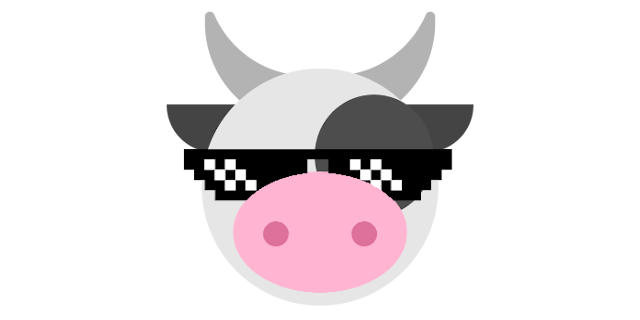

# Awesome Beef 
A curated list of awesome Beef frameworks, libraries and resources.

Inspired by [awesome-python](https://github.com/vinta/awesome-python).

# Summary
- [Official Resources](#official-resources)
- [Tools](#tools)
    - [Installers](#installers)
    - [LSP](#lsp)
    - [Editors](#editors)
- [Frameworks and Libraries](#frameworks-and-libraries)
    - [Algorithms](#algorithms)
        - [Colors](#colors)
        - [Cryptography and Hashing](#cryptography-and-hashing)
        - [Noise](#noise)
    - [Audio](#audio)
    - [Caching](#caching)
    - [Command Line Interface Development](#command-line-interface-development)
    - [Coroutines](#coroutines)
    - [Game Development](#game-development)
        - [Engines](#engines)
        - [Frameworks](#frameworks)
        - [Libraries](#libraries)
    - [Font](#font)
    - [GUI](#gui)
    - [IoC](#ioc)
    - [Image](#image)
    - [Linq](#linq)
    - [Logging](#logging)
    - [Multimedia](#multimedia)
    - [Networking](#networking)
    - [Scripting Engines](#scripting-engines)
    - [Serialization](#serialization)
    - [Themes](#themes)
    - [Text Processing](#text-processing)
- [Projects and Articles](#projects-and-articles)
    - [Dynamic Linking](#dynamic-linking)
    - [Networking](#networking)
- [Contributing](#contributing)

# Official resources
*The official documentation and resource for the Beef programming language.*

- [Official website](https://beeflang.org) - Official website of the Beef programming language.
- [Official documentation](https://beeflang.org/docs) - Official documentation explaining how the language works and its philosophy.
- [Corelib documentation](https://www.beeflang.org/docs/doxygen/corlib/html/index.html) - Auto generated documentation for the core library.
- [Official repository](https://github.com/beefytech/Beef) - Repository hosting the language and its associated IDE.

# Tools

## LSP
[Beef LSP](https://github.com/MineGame159/Beef/tree/lsp/BeefLsp) - An unofficial LSP server which works with any LSP-compatible editor and a Visual Studio Code extension.

## Editors
[Try Beef](https://trybeef.netlify.app/) - A web based editor for compiling and running simple Beef programs.

# Frameworks and Libraries
## Algorithms
*Libraries providing implementations of algorithms*

### Colors
- [RGBeef](https://github.com/farism/RGBeef) - Create, convert, and manipulate color spaces.

### Cryptography and Hashing
- [Beef-Hash](https://github.com/thibmo/Beef-Hash) - Collection of hashing algorithms.
- [Beef-OpenSSL](https://github.com/thibmo/Beef-OpenSSL) - Beef port of OpenSSL.

### Noise
- [FastNoise_Beef](https://github.com/EinScott/FastNoise_Beef) - Beef port of the FastNoise Lite library.

## Audio
- [Beef-FMOD](https://github.com/LauraRozier/Beef-FMOD) - Beef bindings for the FMOD audio processing library.
- [BeefBass](https://github.com/disarray2077/BeefBass) - Beef Wrapper for the 'Bass' Audio Library.

## Caching
- [System.Caching](https://github.com/thibmo/System.Caching) - A BeefLang implementation of .net System.Runtime.Caching, useful to prevent double-triggering, response caching, data caching, etc.

## Command Line Interface Development
*Libraries for building CLI applications*

- [CowieCLI](https://github.com/RogueMacro/CowieCLI) - Awesome command line arguments parsing library.

## Coroutines
*Libraries related to coroutines and multithread programming*

- [Minicoro-beef](https://github.com/jazzbre/minicoro-beef) - Wrapper for the C asymetric coroutines library.

## Game Development
*Awesome game development libraries and frameworks.*

### Engines
- [Strawberry](https://github.com/MattThorson/Strawberry) - A 2D game engine using SDL, focused on usability and simplicity.
- [Tilengine-beef](https://github.com/rootbeerking/Tilengine-Beef) - Beef Language wrapper for Tilengine 2D Graphics Engine.

### Frameworks
- [Pile](https://github.com/EinScott/Pile) - A simple extendable game framework.
- [Raylib-beef](https://github.com/Starpelly/raylib-beef) - Autogenerated raylib bindings for the newest version of raylib.
- [Raylib-beef 3.7](https://github.com/M0n7y5/raylib-beef) - Handmade bindings for the version 3.7 of raylib.

### Libraries
- [BGFX-beef](https://github.com/jazzbre/bgfx-beef) - A Cross-platform, graphics API agnostic, "Bring Your Own Engine/Framework" style rendering library.
    - Also linked in the official [BGFX repository](https://github.com/bkaradzic/bgfx/tree/master/bindings/bf). 
- [Box2D-beef](https://github.com/jazzbre/box2d-beef) - 2D physics engine for games.
- [Bulkan](https://github.com/jayrulez/Bulkan) - Low level Vulkan bindings.
- [Chipmunk2D-beef](https://github.com/jazzbre/Chipmunk2D-beef) - A simple, lightweight, fast and portable 2D rigid body physics library.
- [directx-beef](https://github.com/aharabada/directx-beef) - Beef wrapper library for Direct3D 11.
- [Dxc-Beef](https://github.com/jayrulez/Dxc-Beef) - [DirectXShaderCompiler](https://github.com/microsoft/DirectXShaderCompiler) bindings
- [Glfw-beef](https://github.com/MineGame159/glfw-beef) - Beef wrapper library for GLFW.
- [Opengl-beef](https://github.com/MineGame159/opengl-beef) - OpenGL loader for Beef.
- [SDL2-beef](https://github.com/jazzbre/sdl2-beef) - SDL2 Wrapper, synced with SDL2 shipped with Beef.
- [SDL3-Beef](https://github.com/Booklordofthedings/SDL3-Beef) - A binding for SDL3 to Beef, trying to be as close to the original interface as possible.
- [Shaderc-beef](https://github.com/MineGame159/shaderc-beef) - A Beef wrapper library for [Shaderc](https://github.com/google/shaderc).
- [sokol-beef](https://github.com/kochol/sokol-beef) - Auto generated library for [sokol](https://github.com/floooh/sokol) headers.
- [SoLoud-beef](https://github.com/jarikomppa/soloud) - easy to use, free, portable c/c++ audio engine for games.
- [SPIRV-Cross-Beef](https://github.com/jayrulez/SPIRV-Cross-Beef) - SPIRV-Cross bindings.
- [WGPU-beef](https://github.com/MineGame159/wgpu-beef) - Beef wrapper library for WGPU (more specifically wgpu-native).

## Font
- [BeefFNT](https://github.com/disarray2077/BeefFNT) - A Beef library for reading and writing AngelCode bitmap fonts in binary, XML, and text.

## GUI
*Libraries and frameworks for general GUI programming*
- ImGui
    - [ImGui-beef](https://github.com/RogueMacro/imgui-beef) - Beef wrapper library for ImGui.
    - [ImGuibgfx-beef](https://github.com/jazzbre/imguibgfx-beef) - ImGui wrapper using SDL2 and BGFX.
    - [ImGui-Vulkan-beef](https://github.com/MineGame159/imgui-vulkan-beef) - Vulkan backend for Dear ImGui in Beef.
- [Mince](https://github.com/SteveSmithSoftware/Mince) - A GUI Toolkit for use with the Beef Programming Language.
- [NativeFileDialog-beef](https://github.com/jazzbre/nativefiledialog-beef) - Portable library to invoke native file dialogs.
- [Ultralight-beef](https://github.com/kumikumi/Ultralight-beef) - Write UI code for your game/application with web technologies (HTML/CSS/JS) using a lightweight web renderer.

## IoC
*Inversion of Control libraries and frameworks*

- [Steak.DependencyInjection](https://github.com/RogueMacro/Steak.DependencyInjection) - Simple dependency injection library.

## Image
*Libraries for image loading and processing*

- [StbImageBeef](https://github.com/StbBeef/StbImageBeef) - Beef port of the stb_image.h C header library.

## Linq
*Linq related libraries.*

- [Beef.Linq](https://github.com/disarray2077/Beef.Linq) - An awesome Beef library to mimic .NETs linq, but better and faster.

## Logging
*Logging libraries and frameworks.*

- [Steak.Logging](https://github.com/RogueMacro/Steak.Logging) - An awesome logging library for Beef.

## Multimedia
*Multimedia related libraries.*

- [FFmpeg-Beef](https://github.com/disarray2077/FFmpeg-Beef) - FFmpeg bindings for BeefLang.

## Networking
*Networking related libraries*

- [Beef-Net](https://github.com/thibmo/Beef-Net) - BeefLang networking library, based on lNet

## Scripting Engines
*Awesome scripting libraries.*

- [KeraLua-Beef](https://github.com/disarray2077/KeraLua-Beef) - Native bindings of Lua 5.4 for BeefLang
- [Lua-beef](https://github.com/thibmo/lua-beef) - BeefLang wrapper library for Lua.

## Serialization
*Libraries for serializing and parsing text*
- [Atma.Json](https://github.com/xposure/Atma.Json) - Json serialization framework.
- [Beef-toml](https://github.com/killamaaki/beef-toml) - Toml parser/serializer library.
- [bon](https://github.com/EinScott/bon) - A reflection based structure serialization library designed for Beef.
- [json](https://github.com/EinScott/json) - A light arbitrary JSON tree read and write library.
- [Xml-Beef](https://github.com/thibmo/Xml-Beef) - Single-file XML parser in Beef with doctype support.

## Themes
*IDE themes.*

- [Base16TomorrowDark](https://github.com/Jmacklin308/BeefIDE-Base16TomorrowDark) - Base 16 Tomorrow Dark Theme.
- [Dracula](https://github.com/fhornung/beef-dracula) - Dracula theme.
- [OneDarkPro](https://github.com/thibmo/BeefIDE-OneDarkPro) - Atom's iconic One Dark theme.
- [SimplyDark](https://github.com/M0n7y5/BeefIDE-SimplyDark) - Simple dark theme.

## Text Processing
*Libraries for parsing and manipulating plain texts.*

- [Oregano](https://github.com/zerkawei/Oregano) - Regex implementation supporting captures, lookarounds and backreferences.
- [TinyRegex](https://github.com/disarray2077/TinyRegex) - Tiny implementation of a subset of Regex.

# Projects and Articles
*To show or explain what beef is capable of.*

## Dynamic Linking

- [Beef DLL Creation & Research](https://m0n7y5.github.io/beef-dll-creation-and-research-2/) - Showcase of a fully functional Beef DLL.

##  Networking

- [SampleListener](https://github.com/jairopaiva/SampleListener) - Example of an echo server showing the use of System.Net.Socket to listen for clients connections.

---

# Contributing

Your contributions are always welcome! Please take a look at the [contribution guidelines](https://github.com/Jonathan-Racaud/awesome-beef/blob/master/CONTRIBUTING.md) first.

I will keep some pull requests open if I'm not sure whether those libraries are awesome, you could [vote for them](https://github.com/Jonathan-Racaud/awesome-beef/pulls) by adding :+1: to them. Pull requests will be merged when their votes reach **20**.
